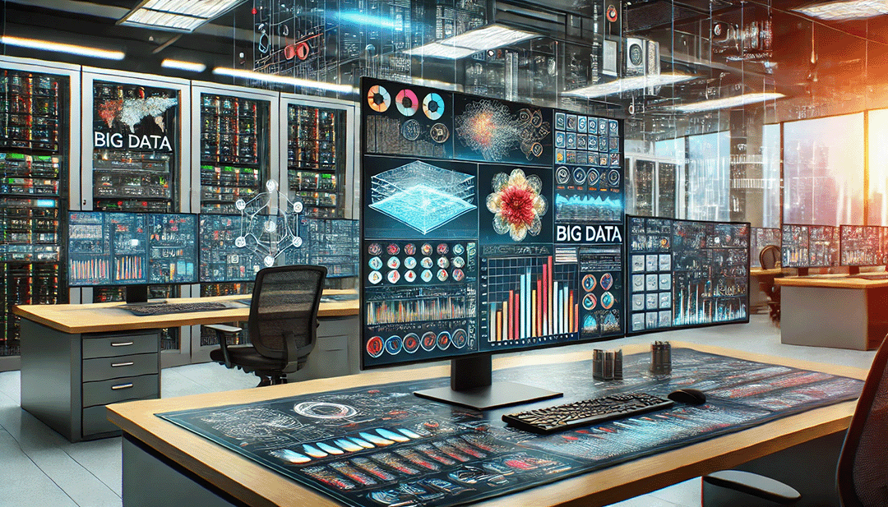

# Análisis de Datos y Big Data

---

**Fecha:** 11 de agosto de 2025  

**Responsable:** Dr. Ulises Olivares Pinto  

**Auxiliares:** 
+ Joshelyn Yanori Mendoza Alfaro  
+ Fernando Ramírez González

## Objetivo General
Manejar tecnologías de procesamiento de datos a gran escala y aprender métodos estadísticos y de machine learning utilizando herramientas open source y Python para predecir tendencias y comportamientos.

## Objetivos Específicos
- Comprender los conceptos y herramientas fundamentales de Big Data.
- Aprender a utilizar tecnologías y plataformas para el procesamiento de datos a gran escala.
- Desarrollar habilidades en el análisis estadístico y machine learning.
- Aplicar técnicas de machine learning para la predicción y análisis de tendencias.
- Implementar y evaluar modelos de análisis de datos en diferentes contextos.
- Conocer las prácticas y consideraciones éticas en el manejo de grandes volúmenes de datos.

## Modalidad
> Presencial  

## Prerrequisitos
- Computadora personal con acceso a internet
- Cuenta de Gmail
- Conocimientos básicos de programación.

## Temario

| Sesiones    | Tema                                            | Subtemas                                                                                                                                                   | Material de Consulta                                                                                                     | Ejercicios y Demostraciones | Presentación                |
|-------------|-------------------------------------------------|-----------------------------------------------------------------------------------------------------------------------------------------------------------|-------------------------------------------------------------------------------------------------------------------------|------------------------------|-----------------------------|
| Sesión 1    | Análisis de Datos con Machine Learning          | <ul><li>Introducción a Machine Learning</li><li>Técnicas de Machine Learning para Big Data</li><li>Herramientas y Bibliotecas Open Source (Scikit-learn, TensorFlow, etc.)</li></ul>              | ["Hands-On Machine Learning with Scikit-Learn, Keras, and TensorFlow" por Aurélien Géron](https://www.oreilly.com/library/view/hands-on-machine-learning/9781492032632/) | --                           | [Sesión 1](/pdf/Sesión1.pdf) |
| Sesión 2    | Visualización, estadística descriptiva y análisis exploratorio de datos | <ul><li>Visualización de datos</li><li>Limpieza y depuración</li><li>Análisis exploratorio de datos (AED)</li></ul> | ["Practical Statistics for Data Scientists" por Peter Bruce y Andrew Bruce](https://www.oreilly.com/library/view/practical-statistics-for/9781492072942/)              | <ul><li>[Código día 2](code/DA_BigData_BLOQUE_Sesión_2_Sin_respuestas.ipynb)</li><li>[App de ejemplo](demos/app.py)</li><li>[Ejercicios sesión 2](demos/demo_day_1.ipynb)</li></ul> | [Sesión 2](/pdf/Sesión2.pdf) |
| Sesión 3    | Repaso: importación y limpieza de datos         | <ul><li>Lectura de CSV, Excel, JSON y SQL con Pandas</li><li>Importación desde URLs y APIs</li><li>Exploración inicial: `.head()`, `.info()`, `.describe()`</li><li>Manejo de valores nulos (`dropna`, `fillna`)</li><li>Detección de duplicados</li><li>Conversión de tipos de datos y fechas</li></ul> | [Documentación oficial de Pandas](https://pandas.pydata.org/docs/)   [Documentación de Dask DataFrame](https://docs.dask.org/en/stable/dataframe.html) | --  | --  |
| Sesión 4    | Repaso: visualización de datos                  | <ul><li>Matplotlib y Seaborn: barras, histogramas, dispersión y cajas</li><li>Relaciones: `pairplot`, facetas</li><li>Buenas prácticas de diseño</li><li>Archivos grandes con Dask (introducción)</li></ul> | [Tutorial de Matplotlib](https://matplotlib.org/stable/tutorials/index.html)   [Guía de Seaborn](https://seaborn.pydata.org/tutorial.html)   "Storytelling with Data" por Cole Nussbaumer Knaflic | --  | --
| Sesión 5  | Análisis Exploratorio de Datos con Python y Dask | <ul><li>Introducción a Dask y sus Ventajas</li><li>Manipulación y Análisis de Datos a Gran Escala</li><li>Visualización de Datos Distribuidos</li><li>Caso Práctico: EDA con Dask</li></ul> | ["Dask: Parallel Computing with Python" por Matthew Rocklin](https://docs.dask.org/en/latest/)                                                               | [Código de Sesión 5 - Colab](https://colab.research.google.com/drive/1Wl0wz_XWP_mTsAYysySNyBlCqzNkqZNH?usp=sharing)                          | [Sesión 5](/pdf/Sesión5.pdf)
| Sesión 6    | Reducción de dimensiones de datos y algoritmos de clustering | <ul><li>Concepto de reducción de dimensionalidad</li><li>Análisis de Componentes Principales (PCA)</li><li>Ventajas y limitaciones de cada técnica</li><li>Introducción a clustering no supervisado</li><li>Algoritmos: K-Means, DBSCAN y clustering jerárquico</li><li>Evaluación de calidad del clustering (silhouette score, inertia)</li><li>Aplicaciones prácticas en Big Data</li></ul> | ["Pattern Recognition and Machine Learning" por Christopher Bishop](https://www.microsoft.com/en-us/research/publication/pattern-recognition-machine-learning/)   [Documentación de Scikit-learn: clustering](https://scikit-learn.org/stable/modules/clustering.html)   [Documentación de Scikit-learn: reducción de dimensionalidad](https://scikit-learn.org/stable/modules/decomposition.html) | <ul><li>[Código día 6](https://colab.research.google.com/drive/1VEcV9docRegGbZ-FhN_a3ZKEAXRIkqY2?usp=sharing)</li><li>[Demo: Dashboard](https://colab.research.google.com/drive/1KoUimtNMJQqIXA5fZbdsQQURr_D_PDg2?usp=sharing)</li></ul> | [Sesión 6](/pdf/Sesión6.pdf) |
| Sesión 7 | Generación de dashboard con streamlit | <ul><li>conceptos básicos de streamlit</li><li>arquitectura de una app y buenas prácticas</li><li>carga y validación de datos</li><li>controles interactivos (widgets) y estado</li><li>integración  con sklearn (pca y clustering) para visualización</li></ul> | [Documentación de Streamlit](https://docs.streamlit.io/)   [Plotly Express en Python](https://plotly.com/python/plotly-express/)   [scikit-learn: pca](https://scikit-learn.org/stable/modules/generated/sklearn.decomposition.PCA.html)   [scikit-learn: k-means y dbscan](https://scikit-learn.org/stable/modules/clustering.html) | <ul><li> [Streamlit app](/code/new_app.py) </li><li>[Código sesión 7](https://colab.research.google.com/drive/1e89tcPRrdk_n4JIYCvi_4MYZ1HPcrKz9?usp=sharing)</li></ul> | [Sesión 7](/pdf/) |

**Última modificación:** 01 de septiembre de 2025
